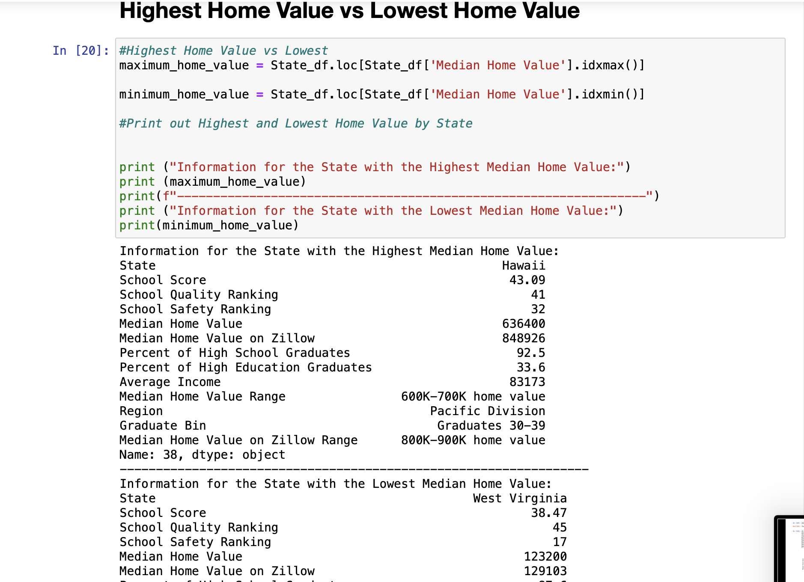

# Project_1_Group_1

## Overview of Project

### Housing Price vs. Public School Education Ranking, Household Income, and Population Education levels
   
* Final data analysis contains ample and complete information in README file
* Final repository is acceptable for professional quality presentation
* Visualizations
    * 6–8 visualizations of data
    * Clear and accurate labeling of images
    * Visualizations supported with ample and precise explanation
    * Analysis and Conclusion 
* Write-up summarizes major findings and implications at a professional level
    * Each question in the project proposal is answered with precise descriptions and findings
    * Findings are strongly supported with numbers and visualizations (5 points)
    * Each question response is supported with a well-discerned statistical analysis from lessons (e.g., aggregation, correlation, comparison, summary statistics, sentiment analysis, and time series analysis)
* Group Presentation
    * All group members spoke during the presentation
    * Group was well prepared
    * Presentation is relevant to material
    * Presentation maintains audience interest
    * Slide Deck
        * Slides are visually clean and professional
        * Slides are relevant to material
        * Slides effectively demonstrate the project 
        * Slides are clear and maintain audience interest

### Purpose
   
* We are utilizing everything we have learned about Python and Pandas on Jupyter Notebook to analyze data in order to get more detailed information about what the pulled data sources show.
* Do Average Home Value, Average Income, Average Household Education Level, and Public School Rankings by state have an impact on each other?

## Analysis

### Analysis of Outcomes Based on Questions

* Do Average Home Value, Average Income, Average Household Education Level, and Public School Rankings by state have an impact on each other?
   
    * Median home value vs income(Madeline)
        * Observation: The T Test and graph show a correlation between Median home value and Average income. As The Median Home Value increases, the Average Income increases.
        * The correlation is 0.78
        * The r-squared is: 0.616
        * The linear regression equation is: y = 0.08x + 45261.73
        * The p-value is 2.9276101336099495e-16
    
    * Median Home value vs education level(Shapoor)
        * Observation: The data shows a positive correlation between the Median Home Value and The Household Education Level. We can also see the data is significantly correlated because the T-Test value is well below 0.05.
        * The correlation is 0.6
        * The r-squared is: 0.361
        * The linear regression equation is: y = 0.0x + 24.65
        * The p-value is 1.2409056167813361e-21
    
    * Education levels vs income levels (Christina)
        * Income by Average Percentage of Graduates 
        The graph average income based on the percentage of graduates among the states. The lower percentage of people with graduate degrees in specific states represent a lower income level. The higher percentage of people with graduate degree represent a higher income percentage.
    
    * Zillow price vs house price(Molly)
        * Observation: The Zillow home values are skewed and priced on average 200K more than the Median Home Value .  The higher the home value the more discrepancy there is in the price between Zillow and the Median Home Value as shown in the line graph "Median Home Value Range vs. Median Home Value"
        * The Median Home Value on Zillow compared to the Median Home Value is statistically significant.  The pvalue is 0.0001796, much less than .05, indicating significance.
    
    * Highest home value vs lowest (Molly)
        * Observation: The difference in income between the Hawaii, the state with the highest median home value, and West Virginia, the state with the lowest median home value is $35,136. While the difference in median home values between Hawaii and West Virginia is $513,200.
    
    * School safety vs school score and school rank (Madeline)
        * Observation: The school saftey ranking we can see have a correlation on the school quality and school score. As the school safety ranking increases, the school quality score increases, and the school score decreases overall. However, the T Test revealed that the school safety ranking has an impact on the school score but not the school quality ranking.
        * School Safety Ranking vs School Score
            * The P-Value is 1.1867914554149044e-15
            * The correlation is -0.69
            * The r-squared is: 0.475
            * The linear regression equation is: y = -0.45x + 61.42
        * School Safety Ranking vs School Quality Ranking
            * The P-Value is 0.9303770450775772
            * The correlation is 0.6
            * The r-squared is: 0.362
            * The linear regression equation is: y = 0.61x + 10.17

    * Median Home value vs public school score(Shapoor)
        * Observation: The T-Test shows the data is significant to a correlation of some kind. The correlation value is showing that the correlation between the Median Home Value and the Public School Score is very low, so we don't see a strong correlation between the two variables. 
        * The p-value is 1.244833437318992e-21
        * The correlation is 0.23
        * The r-squared is: 0.051
        * The linear regression equation is: y = 2405.19x + 116909.03

## Results

* What questions do we still have?
    * People need money to live, buy houses, and go to a good school. 
    * The economy in the country is increasing. What do we do when people are priced out of the essentials of comfortable living?

### Jupyter Notebook Pictures

